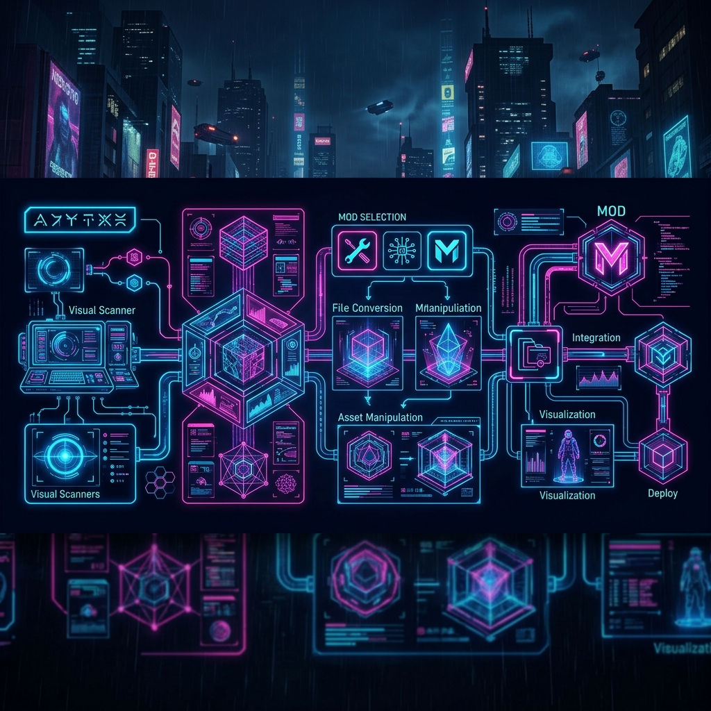

<div align="center">



# CP77 Modding Pipeline

A streamlined GUI tool to compile 3D model exports (GLB/GLTF) into fully functioning Cyberpunk 2077 clothing mods - with auto-generated names, textures, icons, and spawn commands.

[](https://www.python.org/)
[](https://www.cyberpunk.net/)
[](https://doc.qt.io/qtforpython-6/)
[](https://github.com/psiberx/cp2077-archive-xl)
[](https://github.com/psiberx/cp2077-tweak-xl)

</div>

## Features

- **Automated WolvenKit Project Setup** - directory structure, configs, and ArchiveXL/TweakXL files
- **Custom GLB->CR2W Mesh Converter** - no WolvenKit dependency for mesh conversion
- **Per-Material Settings** - Transparent (alpha mask) and Two-sided checkboxes per material group
- **Foot-State Variants for Leg Items** - tights/stockings that switch mesh with footwear
- **Custom Icon Sheet Generation** - auto-slices source icon PNGs into inventory icons
- **Multi-Material Support** - multiple texture sets per mesh (corset + ruffle, fishnet + skin, etc.)
- **Body-Type Variants** - per-body meshes for ebb, eve, angel, rb, wb, etc.
- **Progress Bar & Cancel** - real-time progress tracking with cancel support
- **Per-Item Compile** - rebuild a single item without re-running the full pipeline
- **Dry-Run Preview** - see what files would be generated before writing anything

## Getting Started

### Requirements

- **Python 3.10+** with pip
- **WolvenKit CLI** - download from [WolvenKit releases](https://github.com/WolvenKit/WolvenKit/releases)
- **Cyberpunk 2077** with these mods installed:
  - [ArchiveXL](https://github.com/psiberx/cp2077-archive-xl) - dynamic mesh/material substitution
  - [TweakXL](https://github.com/psiberx/cp2077-tweak-xl) - item registration
  - [Equipment-EX](https://github.com/psiberx/cp2077-equipment-ex) - (optional) custom outfit slots

### Install Dependencies

```bash
pip install pygltflib numpy Pillow
```

For the Qt GUI (recommended):

```bash
pip install PySide6
```

> `pygltflib` and `numpy` are required by the mesh converter. `Pillow` is used for icon previews. `PySide6` is only needed for the Qt GUI.

### Which File to Run

| File | GUI | Description |
|---|---|---|
| `cpmp_qt.py` | Qt (recommended) | Modern docking layout, drag-resizable panels, icon previews built-in |
| `cpmp.py` | Tkinter (built-in) | No extra dependencies beyond Python's stdlib, works everywhere |

Both use the same pipeline engine (`cr2w_mesh.py`) and produce identical output. The Qt version has a nicer UI; the tkinter version has zero extra dependencies.

```bash
# Recommended (Qt GUI)
python cpmp_qt.py

# Alternative (tkinter, no PySide6 needed)
python cpmp.py
```

### How to Use the GUI

1. **Set your paths** at the top of the window:
   - **GLB Export Dir** - the folder where your `.glb` files and textures live
   - **Mod Output Dir** - where the WolvenKit project will be generated (e.g., `C:\Users\You\Documents\WolvenKit`)
   - **Mod Base Name** - your mod's identifier (e.g., `Casual_Pants`). No spaces.
   - **WolvenKit CLI** - path to `WolvenKit.CLI.exe`

2. **Click Scan** - the pipeline scans your export folder and creates an item card for each subfolder containing `.glb` files.

3. **Configure each item** on its card:
   - **Vanilla Base Category** - which clothing slot (Legs, Inner Torso, Feet, etc.)
   - **Equipment-EX Outfit Slot** - (optional) custom slot for non-vanilla outfits
   - **Needs body-type variants** - uncheck for accessories/heels that look the same on all bodies
   - **Has foot state variants** - (Leg slot only) check if your tights have flat/lifted/heel variants
   - **Display Name / Description** - what players see in-game
   - **Rarity / Icon** - quality tier and icon generation mode
   - **Material Settings** - per material group: Transparent (alpha mask) and 2-sided checkboxes

4. **Set global options** in the middle panel:
   - **Color Variants** - comma-separated color names matching your `_color_{variant}.png` files
   - **Body Types** - which body shapes to generate (default: `angel, eve, wb`)

5. **Click Process & Compile** - the pipeline runs:
   - Scans and copies GLBs/textures
   - Converts GLBs to CR2W `.mesh` format
   - Imports textures as `.xbm` files
   - Generates ArchiveXL, TweakXL, and localization configs
   - Compiles everything via WolvenKit CLI

6. **Open the project** in WolvenKit and click **Pack** to deploy.

### Spawning in Game (CET)

```lua
Game.AddToInventory("Items.your_mod_name", 1)
```

Replace `your_mod_name` with your Mod Base Name (e.g., `Casual_Pants`).

## Export Folder Structure

Your "GLB Export Dir" is the root folder containing your exported models and textures. The pipeline scans subfolders automatically.

### Simple Layout (single-material items)

```
MyModExport/
├── my_dress/
│   ├── my_dress.glb
│   ├── my_dress_color_blue.png
│   ├── my_dress_color_pink.png
│   ├── my_dress_n.png
│   ├── my_dress_r.png
│   └── my_dress_icon_blue.png
├── my_boots/
│   ├── my_boots.glb
│   ├── my_boots_color_black.png
│   └── my_boots_n.png
```

### Multi-Material Layout

Each material group is a separate mesh **object** in Blender (not a material slot). The object name becomes the texture prefix.

```
MyModExport/
├── fishnet_tights/
│   ├── fishnet_tights_ebb.glb          <- GLB with 2 mesh objects: "corset" + "ruffle"
│   ├── corset_color_blue.png
│   ├── corset_n.png
│   ├── ruffle_color_blue.png
│   ├── ruffle_n.png
│   └── fishnet_tights_icon_blue.png
```

### Foot-State Leg Items

For tights/stockings that change shape with footwear (flat vs heels), export separate GLBs per foot state. Check "Has foot state variants" in the UI.

```
MyModExport/
├── fishnet_tights/
│   ├── fishnet_tights_flat_ebb.glb     <- flat feet geometry
│   ├── fishnet_tights_lifted_ebb.glb   <- default (lifted) geometry
│   ├── fishnet_tights_heel_ebb.glb     <- high heel geometry
│   ├── fishnet_tights_flat_angel.glb   <- per body type x foot state
│   ├── fishnet_tights_lifted_angel.glb
│   ├── fishnet_tights_heel_angel.glb
│   ├── fishnet_color_black.png
│   └── fishnet_n.png
```

**GLB naming for foot states:** `{name}_{flat|lifted|heel}_{body}.glb`

If you omit the foot state (just `{name}_{body}.glb`), it's treated as the default (lifted) variant.

### Per-Body-Type Layout

If your item needs different geometry per body type (shape differences), export one GLB per body:

```
MyModExport/
├── my_corset/
│   ├── my_corset_ebb.glb
│   ├── my_corset_ebbp.glb
│   ├── my_corset_angel.glb
│   ├── my_corset_color_crimson.png
│   └── my_corset_n.png
```

If your item looks the same on all body types (heels, accessories), export one GLB without a body suffix and uncheck "Needs body-type variants" in the UI.

## Preparing Your 3D Models

### Object Names = Material Names

> **Important:** WolvenKit's GLB exporter does **not** preserve Blender material slot names. The pipeline uses **mesh object names** (the name in Blender's Outliner) to identify material groups. Rename the **objects**, not the materials.

- Object named `ruffle` -> textures must be `ruffle_color_*.png`, `ruffle_n.png`, etc.
- Object named `corset` -> textures must be `corset_color_*.png`, `corset_n.png`, etc.

### Texture Naming Convention

All textures go in the same folder as the GLB:

| Pattern | Purpose | Example |
|---|---|---|
| `{prefix}_color_{variant}.png` | Diffuse/color map | `ruffle_color_blue.png` |
| `{prefix}_n.png` | Normal map | `ruffle_n.png` |
| `{prefix}_r.png` | Roughness map | `ruffle_r.png` |
| `{prefix}_m.png` | Metalness map | `ruffle_m.png` |
| `{prefix}_opacity.png` | Opacity mask (alpha) | `fishnet_opacity.png` |
| `{item}_icon_{variant}.png` | Inventory icon | `my_dress_icon_blue.png` |

**Single-material:** `{prefix}` = item name. **Multi-material:** `{prefix}` = object name (alphabetically first = no prefix).

### Per-Material Settings in the UI

For each material group detected in your GLB, you can toggle:

- **Transparent** - Enables alpha masking. The diffuse texture's alpha channel becomes the opacity mask. Use for fishnets, lace, sheer fabric, etc.
- **2-sided** - Renders both faces of the mesh. Use for thin geometry like strings, ribbons, or cloth edges.

## Template Meshes

The `template_meshes/` folder contains base `.mesh` files per clothing slot. The pipeline copies the template and replaces vertex/index data with your GLB geometry while preserving rig weights and bone mappings.

> **Recommendation:** Use a full body player mesh as your template for proper rig weights. Extract `t0_000_pwa_base__full.mesh` (Female V) or `t0_000_pma_base__full.mesh` (Male V) from WolvenKit's Asset Browser.

## Acknowledgments

- **WolvenKit** ([GitHub](https://github.com/WolvenKit/WolvenKit)) - CR2W file format specs and CLI tool (GPL v3)
- **Inkatlas JSON structure** based on the official `single_item_template.inkatlas.json`
